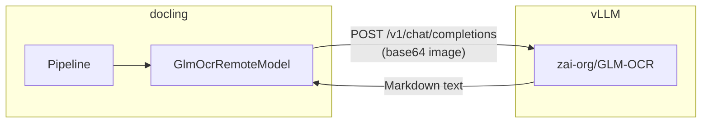

# docling-glm-ocr

A docling OCR plugin that delegates text recognition to a remote
[GLM-OCR](https://huggingface.co/zai-org/GLM-OCR) model served by vLLM.

---

<p align="center">
  <a href="https://github.com/DCC-BS/docling-glm-ocr">GitHub</a>
  &nbsp;|&nbsp;
  <a href="https://pypi.org/project/docling-glm-ocr/">PyPI</a>
</p>

---

[](https://pypi.org/project/docling-glm-ocr/)
[](https://pypi.org/project/docling-glm-ocr/)
[](https://github.com/DCC-BS/docling-glm-ocr/blob/main/LICENSE)
[](https://github.com/DCC-BS/docling-glm-ocr/actions/workflows/main.yml)
[](https://github.com/astral-sh/ruff)
[](https://codecov.io/gh/DCC-BS/docling-glm-ocr)


## Overview

`docling-glm-ocr` is a [docling](https://github.com/DS4SD/docling) plugin that
replaces the built-in OCR stage with a call to a remote
[GLM-OCR](https://huggingface.co/zai-org/GLM-OCR) model hosted on a
[vLLM](https://github.com/vllm-project/vllm) server.

Each page crop is sent to the vLLM OpenAI-compatible chat completion endpoint
as a base64-encoded image. The model returns Markdown-formatted text which
docling merges back into the document structure.

The plugin registers itself under the `"glm-ocr-remote"` OCR engine key so it
can be selected per-request through docling or docling-serve without changing
application code.

## Requirements

- Python 3.13+
- A running vLLM server hosting `zai-org/GLM-OCR` (or any compatible model)

## Installation

```bash
# with uv (recommended)
uv add docling-glm-ocr

# with pip
pip install docling-glm-ocr
```

## Usage

### Python SDK

```python
from docling.datamodel.base_models import InputFormat
from docling.datamodel.pipeline_options import PdfPipelineOptions
from docling.document_converter import DocumentConverter, PdfFormatOption

from docling_glm_ocr import GlmOcrRemoteOptions

pipeline_options = PdfPipelineOptions(
    allow_external_plugins=True,
    ocr_options=GlmOcrRemoteOptions(
        api_url="http://localhost:8001/v1/chat/completions",
        model_name="zai-org/GLM-OCR",
    ),
)

converter = DocumentConverter(
    format_options={
        InputFormat.PDF: PdfFormatOption(pipeline_options=pipeline_options)
    }
)
result = converter.convert("document.pdf")
print(result.document.export_to_markdown())
```

### docling-serve

Select the engine per-request via the standard API:

```bash
curl -X POST http://localhost:5001/v1/convert/source \
  -H 'Content-Type: application/json' \
  -d '{
    "options": {
      "ocr_engine": "glm-ocr-remote"
    },
    "sources": [{"kind": "http", "url": "https://arxiv.org/pdf/2501.17887"}]
  }'
```

The server must have `DOCLING_SERVE_ALLOW_EXTERNAL_PLUGINS=true` set so the
plugin is loaded automatically.

## Configuration

### Environment variables

| Variable | Description | Default |
|---|---|---|
| `GLMOCR_REMOTE_OCR_API_URL` | vLLM chat completion URL | `http://localhost:8001/v1/chat/completions` |
| `GLMOCR_REMOTE_OCR_PROMPT` | Text prompt sent with each image crop | see below |

### `GlmOcrRemoteOptions`

All options can be set programmatically via `GlmOcrRemoteOptions`:

| Option | Type | Description | Default |
|---|---|---|---|
| `api_url` | `str` | OpenAI-compatible chat completion URL | `GLMOCR_REMOTE_OCR_API_URL` env or `http://localhost:8001/v1/chat/completions` |
| `model_name` | `str` | Model name sent to vLLM | `zai-org/GLM-OCR` |
| `prompt` | `str` | Text prompt for each image crop | `GLMOCR_REMOTE_OCR_PROMPT` env or default prompt |
| `timeout` | `float` | HTTP timeout per crop (seconds) | `120` |
| `max_tokens` | `int` | Max tokens per completion | `16384` |
| `lang` | `list[str]` | Language hint (passed to docling) | `["en"]` |

Default prompt:

```
Recognize the text in the image and output in Markdown format.
Preserve the original layout (headings/paragraphs/tables/formulas).
Do not fabricate content that does not exist in the image.
```

## Architecture



For each page the model:
1. Collects OCR regions from the docling layout analysis
2. Renders each region at 3× scale (216 dpi) using the page backend
3. Encodes the crop as a base64 PNG data URI
4. POSTs a chat completion request to the vLLM endpoint
5. Returns the recognised text as `TextCell` objects for docling to merge

## Starting a GLM-OCR vLLM server

```bash
docker run -d \
  --rm --name ocr-glm \
  --gpus device=0 \
  --ipc=host \
  -p 8001:8000 \
  -v "${HOME}/.cache/huggingface:/root/.cache/huggingface" \
  -e "HF_TOKEN=${HF_TOKEN}" \
  --entrypoint /bin/bash \
  vllm/vllm-openai:latest \
  -c "uv pip install --system --upgrade transformers && \
      exec vllm serve zai-org/GLM-OCR \
        --served-model-name zai-org/GLM-OCR \
        --port 8000 \
        --trust-remote-code"
```

The plugin will connect to `http://localhost:8001/v1/chat/completions` by default.

## Development

### Setup

```bash
git clone https://github.com/DCC-BS/docling-glm-ocr.git
cd docling-glm-ocr
make install
```

### Available commands

```
make install     Install dependencies and pre-commit hooks
make check       Run all quality checks (ruff lint, format, ty type check)
make test        Run tests with coverage report
make build       Build distribution packages
make publish     Publish to PyPI
```

### Running tests

```bash
make test
```

Tests are in `tests/` and use [pytest](https://pytest.org).
Coverage reports are generated at `coverage.xml` and printed to the terminal.

### Code quality

This project uses:

- **[ruff](https://github.com/astral-sh/ruff)** – linting and formatting
- **[ty](https://github.com/astral-sh/ty)** – type checking
- **[pre-commit](https://pre-commit.com/)** – pre-commit hooks

Run all checks:

```bash
make check
```

### Releasing

Releases are published to PyPI automatically.
Update the version in `pyproject.toml`, then trigger the **Publish** workflow from GitHub Actions:

```
GitHub → Actions → Publish to PyPI → Run workflow
```

The workflow tags the commit, builds the package, and publishes to PyPI via trusted publishing.

## License

[MIT](LICENSE) © Yanick Schraner
